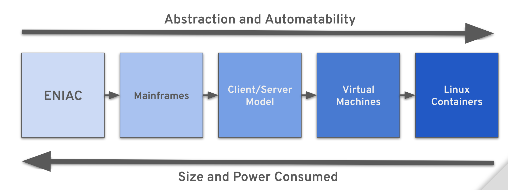
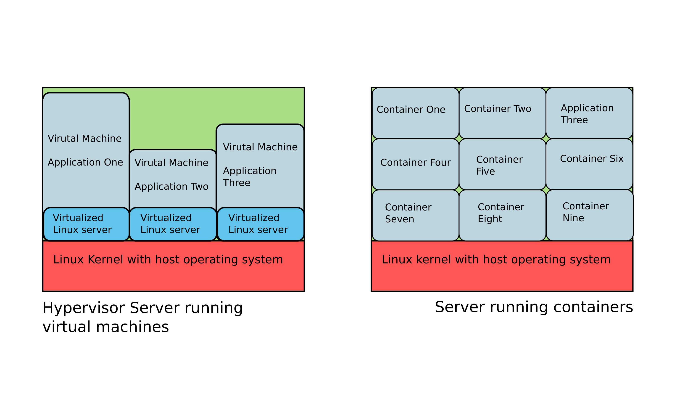
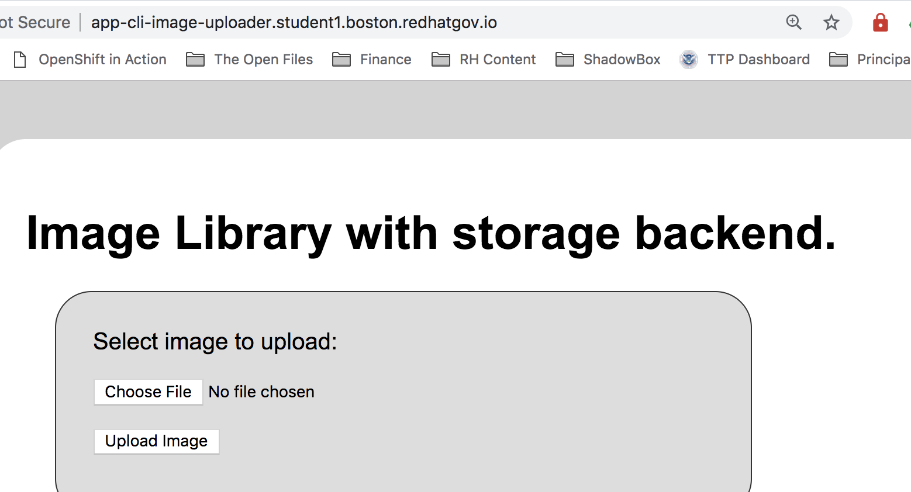
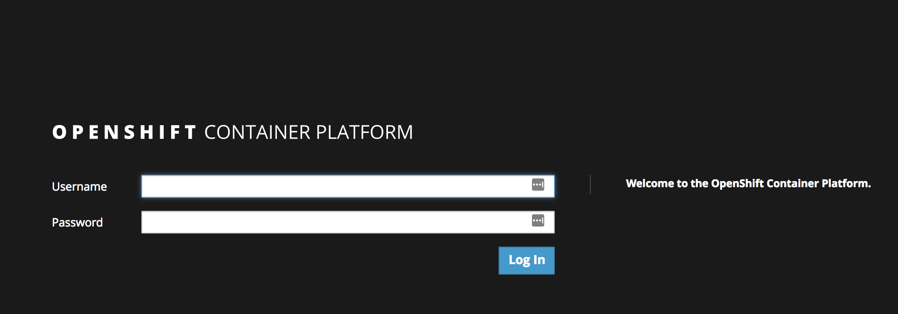
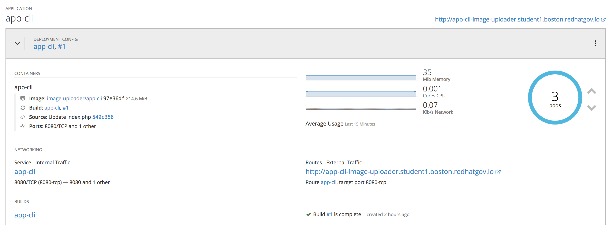
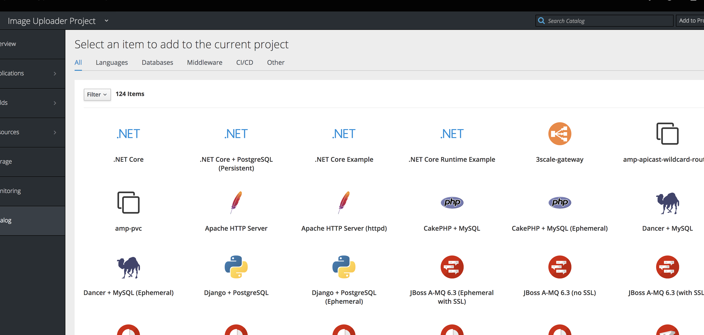
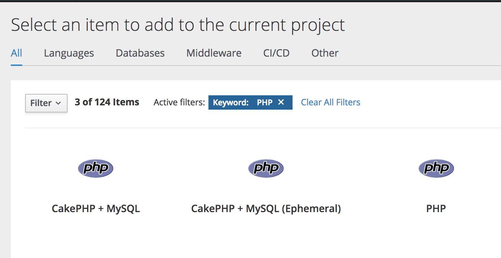
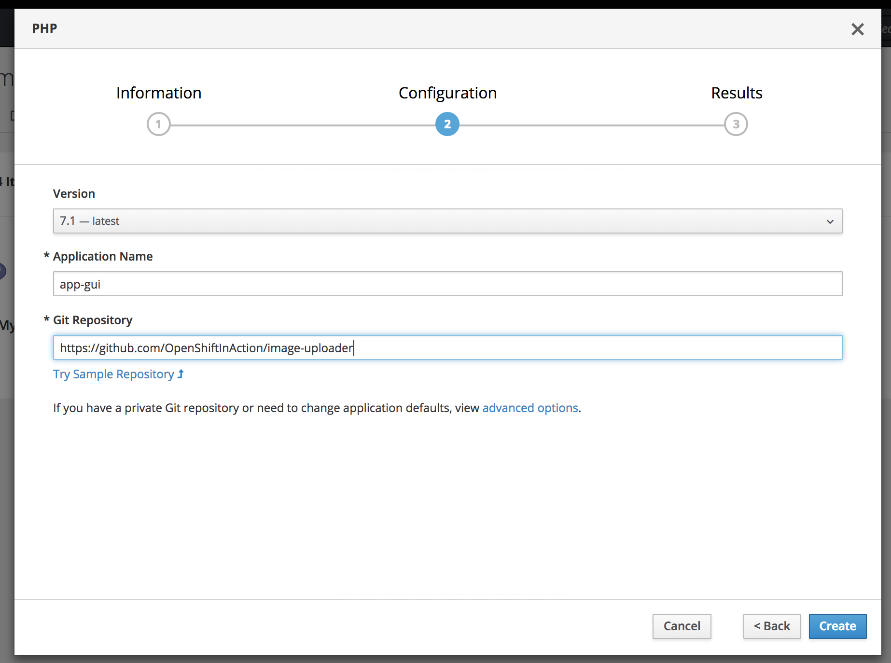
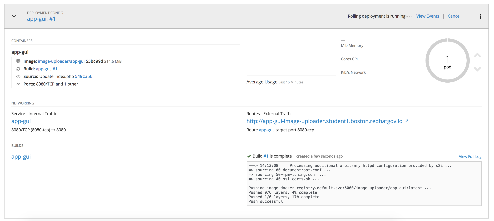
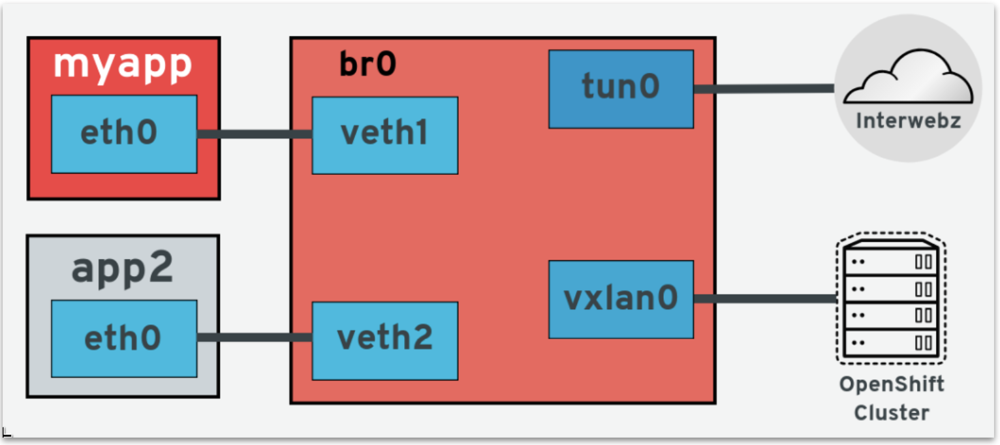

# Better Together: OpenShift and Ansible Workshop  
**Operations Lab Guide**

#### 1.0 - Getting to know Ansible

To get to know Ansible, we're going to rely on [some slideware](https://s3.amazonaws.com/openshift-ansible-workshop-materials/ansible-essentials.html), along with some live examples in your OpenShift cluster. You'll be running these commands from your cluster's bastion host, which is already configured with Ansible and an inventory that references your OpenShift cluster.

#### 2.0 - OpenShift Architecture

In this section we'll discuss the fundamental components that make up OpenShift. Any Ops-centric discussion of an application platform like OpenShift needs to start with containers; both technically and from a perspective of value. We'll start off talking about why containers are the best solution today to deliver your applications.

We promise to not beat you up with slides after this, but we do have a few more. Let's use the [OpenShift Technical Overview](https://s3.amazonaws.com/openshift-ansible-workshop-materials/openshift_technical_overview.pdf) to become familiar with the core OpenShift concepts before we dive down into the fun details.

##### 2.1 - The value of containers

At their heart, containers are the next evolution in how we isolate processes on a Linux system. This evolution started when we created the first computers. They evolved from ENIAC, through mainframes, into the server revolution all the way through virtual machines (VMs) and now into containers.



More efficient application isolation (we'll get into how that works in the next section) provides an Ops team a few key advantages that we'll discuss next.

##### 2.1.1 - Worst Case Scenario provisioning

Think about your traditional virtualization platform, or your workflow to deploy instances to your public cloud of choice for a moment. How big is your default VMDK for your root OS disk? How much extra storage do you add to your EC2 instance, just to handle the 'unknown' situations? Is it 40GB? 60GB?

**This phenomenon is known as _Worst Case Scenario Provisioning_.** In the industry, we've done it for years because we consider each VM a unique creature that is hard to alter once created. Even with more optimized workflows in the public cloud, we hold on to IP addresses, and their associated resources, as if they're immutable once created. It's easier to overspend on compute resources for most of us than to change an IP address in our IPAM once we've deployed a system.

##### 2.1.2 - Comparing VM and Container resource usage

In this section we're going to investigate how containers use your datacenter resources more efficiently. First, we'll focus on storage.

###### 2.1.2.1 - Storage resource consumption

Compared to a 40GB disk image, the RHEL 7 container base image is [approximately 72MB](https://access.redhat.com/containers/?tab=overview#/registry.access.redhat.com/rhel7). It's a widely accepted rule of thumb that container images shouldn't exceed 1GB in size. If your application takes more than 1GB of code and libraries to run, you likely need to re-think your plan of attack.

Instead of each new instance of an application consuming 40GB+ on your storage resources, they consume a couple hundred MegaBytes. Your next storage purchase just got a whole lot more interesting.

###### 2.1.2.2 - CPU and RAM resource consumption

It's not just storage where containers help save resources. We'll analyze this in more depth in the next section, but we want to get the idea into your head for that part of our investigation now. Containers are smaller than a full VM because containers don't each run their own Linux kernel. All containers on a host share a single kernel. That means a container just needs the application it needs to execute and its dependencies. You can think of containers as a "portable userspace" for your applications.

**Additional Concept**  

Because each container doesn't require its own kernel, we also measure startup time in milliseconds! This gives us a whole new way to think about scalability and High Availability!

In your cluster, log in as the admin user and navigate to the default project. Look at the resources your registry and other deployed applications consume. For example the `registry-console` application (a UI to see and manage the images in your OpenShift cluster) is consuming less than 3MB of RAM!


If we were deploying this application in a VM we would spend multiple gigabytes of our RAM just so we could give the application the handful of MegaBytes it needs to run properly.

The same is true for CPU consumption. In OpenShift, we measure and allocate CPUs by the _millicore_, or thousandth of a core. Instead of multiple CPUs, applications can be given the small fractions of a CPU they need to get their job done.

##### 2.1.3 - Summary

Containers aren't just a tool to help developers create applications more quickly. Although they are revolutionary in how they do that. Containers are just marketing hype. Although there's certainly a lot of that going on right now, too.

**For an Ops team, containers take any application and deploy it more efficiently in our infrastructure. Instead of measuring each application in GB used and full CPUs allocated, we measure containers using MB of storage and RAM and we allocate thousandths of CPUs.  

OpenShift deployed into your existing datacenter gives you back resources. For customers deep into their transformation with OpenShfit, an exponential increase in resource density isn't uncommon.**

##### 2.2 - How containers work

You can find five different container experts and ask them to define what a container is, and you're likely to get five different answers. The following are some of our personal favorites, all of which are correct from a certain perspective:

*   A transportable unit to move applications around. This is a typical developer's answer.
*   A fancy Linux process (one of our personal favorites)
*   A more effective way to isolate processes on a Linux system. This is a more operations-centered answer.

##### 2.2.1 - What exacty _is_ a container?

There are t-shirts out there say "Containers are Linux". Well. They're not wrong. The components that isolate and protect applications running in containers are unique to the Linux kernel. Some of them have been around for years, or even decades. In this section we'll investigate them in more depth.

##### 2.2.2 - More effective process isolation

We mentioned in the last section that containers utilize server resources more effectively than VMs (the previous most effective resource isolation method). The primary reason is because containers use different systems in the Linux kernel to isolate the processes inside them. These systems don't need to utilize a full virtualized kernel like a VM does.



Let's investigate what makes a container a container.

##### 2.2.3 - Isolation with kernel namespaces

The kernel component that makes the applications feel isolated are called _namespaces_. Namespaces are a lot like a two-way mirror or a paper wall inside Linux. Like a two-way mirror, from the host we can see inside the container. But from inside the container it can only see what's inside its namespace. And like a paper wall, namepsaces provide sufficient isolation but they're lightweight to stand up and tear down.

On your infrastructure node, log in as your student user and run the `sudo lsns` command. The output will be long, so let's look at the content towards the bottom.

```
$ sudo lsns
NS TYPE  NPROCS   PID USER       COMMAND
...
4026533100 mnt        2 33456 ec2-user   /bin/sh /opt/eap/bin/standalone.sh -Djavax.net.s
4026533101 uts        2 33456 ec2-user   /bin/sh /opt/eap/bin/standalone.sh -Djavax.net.s
4026533102 pid        2 33456 ec2-user   /bin/sh /opt/eap/bin/standalone.sh -Djavax.net.s
4026533103 mnt        1 33536 ec2-user   heapster --source=kubernetes.summary_api:${MASTE
4026533104 uts        1 33536 ec2-user   heapster --source=kubernetes.summary_api:${MASTE
4026533105 pid        1 33536 ec2-user   heapster --source=kubernetes.summary_api:${MASTE
4026533106 mnt        5 35429 1000080000 /bin/bash /opt/app-root/src/run.sh
4026533107 mnt        1 34734 student1   /usr/bin/pod
4026533108 uts        1 34734 student1   /usr/bin/pod
4026533109 ipc        7 34734 student1   /usr/bin/pod
...
```

To limit this content to a single process, specify one of the PIDs on your system by using the `-p` parameter for `lsns`.

```$ sudo lsns -p34734
NS TYPE  NPROCS   PID USER     COMMAND
4026531837 user     210     1 root     /usr/lib/systemd/systemd --switched-root --system
4026533107 mnt        1 34734 student1 /usr/bin/pod
4026533108 uts        1 34734 student1 /usr/bin/pod
4026533109 ipc        7 34734 student1 /usr/bin/pod
4026533110 pid        1 34734 student1 /usr/bin/pod
4026533112 net        7 34734 student1 /usr/bin/pod
```

Let's discuss 5 of these namespaces.

###### 2.2.3.1 - The mount namespace

The mount namespace is used to isolate filesystem resources inside containers. The files inside the base image used to deploy a container. From the point of view of the container, that's all that is available or visible.

If your container has host resources or persistent storage assigned to it, these are made available using a [Linux bind mount](https://unix.stackexchange.com/questions/198590/what-is-a-bind-mount). This means, not matter what you use for your persistent storage backed, your developer's applications only ever need to know how to access the correct directory.

We can see this using the `nsenter` command line utility on your infrastructure node. `nsenter` is used to enter a single namespace that is associated with another PID. When debugging container environments, its value is massive. Here is the root filesystem listing from an infrastructure node.

```
$ sudo ls -al /
total 24
dr-xr-xr-x.  18 root root  236 Nov  9 08:09 .
dr-xr-xr-x.  18 root root  236 Nov  9 08:09 ..
lrwxrwxrwx.   1 root root    7 Nov  9 08:09 bin -> usr/bin
dr-xr-xr-x.   5 root root 4096 Nov  9 08:13 boot
drwxr-xr-x.   2 root root    6 Nov 18  2017 data
drwxr-xr-x.  18 root root 2760 Nov  9 08:13 dev
drwxr-xr-x. 107 root root 8192 Nov  9 09:02 etc
drwxr-xr-x.   4 root root   38 Dec 14  2017 home
lrwxrwxrwx.   1 root root    7 Nov  9 08:09 lib -> usr/lib
lrwxrwxrwx.   1 root root    9 Nov  9 08:09 lib64 -> usr/lib64
drwxr-xr-x.   2 root root    6 Dec 14  2017 media
drwxr-xr-x.   2 root root    6 Dec 14  2017 mnt
...
```

After using `nsenter` to enter the mount namespace for the hawkular container (hawkular is part of the metrics gather system in OpenShift), you see that the root filesystem is different.

```
$ sudo nsenter -m -t 33154[root@ip-172-16-87-199 /]# ll
total 0
lrwxrwxrwx.   1 root root         7 Aug  1 13:02 bin -> usr/bin
dr-xr-xr-x.   2 root root         6 Dec 14  2017 boot
drwxrwsrwx.   4 root 1000040000  61 Nov  9 14:07 cassandra_data
drwxr-xr-x.   5 root root       360 Nov  9 14:07 dev
drwxr-xr-x.   1 root root        66 Nov  9 14:07 etc
drwxrwsrwt.   3 root 1000040000 160 Nov  9 14:04 hawkular-cassandra-certs
drwxr-xr-x.   1 root root        23 Sep 17 18:44 home
lrwxrwxrwx.   1 root root         7 Aug  1 13:02 lib -> usr/lib
lrwxrwxrwx.   1 root root         9 Aug  1 13:02 lib64 -> usr/lib64
drwxr-xr-x.   2 root root         6 Dec 14  2017 media
...
```

The container image for hawkular includes some of the fileystem like a normal server, but it also includes directories that are specific to the application.

###### 2.2.3.1 - The uts namespace

UTS stands for "Unix Time Sharing". This is a concept that has been around since the 1970's when it was a novel idea to allow multiple users to log in to a system simultaneously. If you run the command `uname -a`, the information returned is the UTS data structure from the kernel.

```
$ uname -a
Linux ip-172-16-87-199.ec2.internal 3.10.0-957.el7.x86_64 #1 SMP Thu Oct 4 20:48:51 UTC 2018 x86_64 ...
```

Each container in OpenShift gets its own UTS namespace, which is equivalent to its own `uname -a` output. That means each container gets its own hostname and domain name. This is extremely useful in a large distributed application platform like OpenShift.

We can see this in action using `nsenter`.

```
$ hostname
ip-172-16-87-199.ec2.internal
$ sudo nsenter -u -t 33154
[root@hawkular-cassandra-1-w2vqb student1]# hostname
hawkular-cassandra-1-w2vqb
```

###### 2.2.3.1 - The ipc namespace

The IPC (inter-process communication) namespace is dedicated to kernel objects that are used for processes to communicate with each other. Objects like named semaphores and shared memory segments are included. here. Each container can have its own set of named memory resources and it won't conflict with any other container or the host itself.

###### 2.2.3.1 - The pid namespace

In the Linux world, PID 1 is an important concept. PID 1 is the process that starts all the other processes on your server. Inside a container, that is true, but it's not the PID 1 from your server. Each container has its own PID 1 thanks to the PID namespace. From our host, we see all of the processes we would expect on a Linux server using `pstree`.

**Privileged containers**  

Most of the containers are your infrastructure node run in privileged mode. That means these containers have access to all or some of the host's namespaces. This is a useful, but powerful tool reserved for applications that need to access a host's filesystem or network stack (or other namespaced components) directly. The example below is from an unprivileged container running an Apache web server.

```
# ps --ppid 4470
   PID TTY          TIME CMD
  4506 ?        00:00:00 cat
  4510 ?        00:00:01 cat
  4542 ?        00:02:55 httpd
  4544 ?        00:03:01 httpd
  4548 ?        00:03:01 httpd
  4565 ?        00:03:01 httpd
  4568 ?        00:03:01 httpd
  4571 ?        00:03:01 httpd
  4574 ?        00:03:00 httpd
  4577 ?        00:03:01 httpd
  6486 ?        00:03:01 httpd
```

When you execute the same command from inside the PID namespace, you see a different result. For this example, instead of using `nsenter`, we'll use the `oc exec` command from our control node. It does the same thing, with the primary difference being that we don't need to know the application node the container is deployed to, or its actual PID.

```
$ oc exec app-cli-4-18k2s ps
   PID TTY          TIME CMD
     1 ?        00:00:27 httpd
    18 ?        00:00:00 cat
    19 ?        00:00:01 cat
    20 ?        00:02:55 httpd
    22 ?        00:03:00 httpd
    26 ?        00:03:00 httpd
    43 ?        00:03:00 httpd
    46 ?        00:03:01 httpd
    49 ?        00:03:01 httpd
    52 ?        00:03:00 httpd
    55 ?        00:03:00 httpd
    60 ?        00:03:01 httpd
    83 ?        00:00:00 ps
```

From the point of view of the server, PID 4470 is an `httpd` process that has spawned several child processes. Inside the container, however, the same `httpd` process is PID 1, and its PID namespace has been inherited by its child processes.

PIDs are how we communicate with processes inside Linux. Each container having its own set of Process IDs is important for security as well as isolation.

###### 2.2.3.1 - The network namespace

OpenShift relies on software-defined networking that we'll discuss more in an upcoming section. Because of this, as well as modern networking architectrues, the networking configuration on an OpenShift node can become extremely complex. One of the over-arching goals of OpenShift is to make the devloper's experience consistent no matter the underlying host's complexity. The network namespace helps with this. On your infrastructure node, there could be upwards of 20 defined interaces.

```
$ ip a
1: lo: <loopback,up,lower_up> mtu 65536 qdisc noqueue state UNKNOWN group default qlen 1000
    link/loopback 00:00:00:00:00:00 brd 00:00:00:00:00:00
    inet 127.0.0.1/8 scope host lo
       valid_lft forever preferred_lft forever
    inet6 ::1/128 scope host
       valid_lft forever preferred_lft forever
2: eth0: <broadcast,multicast,up,lower_up> mtu 9001 qdisc mq state UP group default qlen 1000
    link/ether 0e:39:78:cc:a6:58 brd ff:ff:ff:ff:ff:ff
    inet 172.16.87.199/16 brd 172.16.255.255 scope global noprefixroute dynamic eth0
       valid_lft 3178sec preferred_lft 3178sec
    inet6 fe80::c39:78ff:fecc:a658/64 scope link
       valid_lft forever preferred_lft forever
3: docker0: <no-carrier,broadcast,multicast,up> mtu 1500 qdisc noqueue state DOWN group default
    link/ether 02:42:36:9f:24:e7 brd ff:ff:ff:ff:ff:ff
    inet 172.17.0.1/16 scope global docker0
       valid_lft forever preferred_lft forever
4: ovs-system: <broadcast,multicast> mtu 1500 qdisc noop state DOWN group default qlen 1000
    link/ether f6:95:72:0e:09:4f brd ff:ff:ff:ff:ff:ff
5: br0: <broadcast,multicast> mtu 8951 qdisc noop state DOWN group default qlen 1000
    link/ether be:47:c6:da:e5:48 brd ff:ff:ff:ff:ff:ff
6: vxlan_sys_4789: <broadcast,multicast,up,lower_up>mtu 65000 qdisc noqueue master ovs-system state UNKNOWN group default qlen 1000
    link/ether 7a:0b:31:e4:a4:eb brd ff:ff:ff:ff:ff:ff
    inet6 fe80::780b:31ff:fee4:a4eb/64 scope link
       valid_lft forever preferred_lft forever
...</broadcast,multicast,up,lower_up> </broadcast,multicast></broadcast,multicast></no-carrier,broadcast,multicast,up></broadcast,multicast,up,lower_up></loopback,up,lower_up>
```

However, from within one of the containers on that node, you only see an `eth0` and `lo` infterface.

```
$ sudo nsenter -n -t 29774 ip a
1: lo: <loopback,up,lower_up> mtu 65536 qdisc noqueue state UNKNOWN group default qlen 1000
    link/loopback 00:00:00:00:00:00 brd 00:00:00:00:00:00
    inet 127.0.0.1/8 scope host lo
       valid_lft forever preferred_lft forever
    inet6 ::1/128 scope host
       valid_lft forever preferred_lft forever
3: eth0@if10: <broadcast,multicast,up,lower_up>mtu 8951 qdisc noqueue state UP group default
    link/ether 0a:58:0a:81:00:04 brd ff:ff:ff:ff:ff:ff link-netnsid 0
    inet 10.129.0.4/23 brd 10.129.1.255 scope global eth0
       valid_lft forever preferred_lft forever
    inet6 fe80::d0c8:ecff:fe7a:4049/64 scope link
       valid_lft forever preferred_lft forever</broadcast,multicast,up,lower_up> </loopback,up,lower_up>
```

Each container's network namespace has a single outbound interface (eth0) and a loopback address (lots of applications like to use the loopback interface). We'll cover OpenShift SDN (the software-defined network configuration in OpenShift) and how traffic gets from the interface inside a container out to its destination in an upcoming section.

###### 2.2.3.4 - Summary

**Linux kernel namespaces are used to isolate processes running inside containers. They're more lightweight than virtulization technologies and don't require an entire virtualized kernel to function properly. From inside a container, namespaced resources are fully isolated, but can still be viewed and accessed when needed from the host and from OpenShift.**

**We forgot the User namespace?**  

Currently in OpenShift, all containers share a single user namespace. This is due to some lingering performance issues with the user namespace that prevent it from being capable of handling the enterpise scale that OpenShift is designed for. Don't worry, we're working on it.

##### 2.2.4 - Quotas and Limits with kernel control groups

###### What are kernel control groups

Kernel Control Groups are how containers (and other things like VMs and even clever sysadmins) limit the resources available to a given process. Nothing fixes bad code. But with control groups in place, it can become restarting a single service when it crashes instead of restarting the entire server.

In OpenShift, control groups are used to deploy resource limit and requests. Let's set up some limits for applications in a new project that we'll call `image-uploader`. Let's create a new project using our control node.

**Why do I need to be the root user on the control node?**  

When it deploys, OpenShift places a special certificate in `/root/.kube/config`. This certificate allows you to access OpenShift as full admin without needing to log in.

###### 2.2.3.5 - Creating projects

Applications deployed in OpenShift are separated into _projects_. Projects are used not only as logical separators, but also as a reference for RBAC and networking policies that we'll discuss later. To create a new project, use the `oc new-project` command.

```
# oc new-project image-uploader --display-name="Image Uploader Project"
Now using project "image-uploader" on server "https://ip-172-16-129-11.ec2.internal:443".

You can add applications to this project with the 'new-app' command. For example, try:

    oc new-app centos/ruby-22-centos7~https://github.com/openshift/ruby-ex.git

to build a new example application in Ruby.
```

We'll use this project for multiple examples. Before we actually deploy an application into it, we want to set up project limits and requests.

###### 2.2.4.6 - Limits and Requests

OpenShift Limits are per-project maximums for various objects like number of containers, storage requests, etc. Requests for a project are default values for resource allocation if no other values are requested. We'll work with this more in a while, but in the meantime, think of Requests as a lower bound for resources in a project, while Limits are the upper bound.

###### 2.2.4.7 - Creating Limits and Requests for a project

The first thing we'll create for the Image Uploader project is a collection of Limits. This is done, like most things in OpenShift, by creatign a YAML file and having OpenShift process it. On your control node, create a file named `/root/core-resource-limits.yaml`. It should contain the following content.

```
apiVersion: "v1"
kind: "LimitRange"
metadata:
  name: "core-resource-limits"
spec:
  limits:
    - type: "Pod"
      max:
        cpu: "2"
        memory: "1Gi"
      min:
        cpu: "100m"
        memory: "4Mi"
    - type: "Container"
      max:
        cpu: "2"
        memory: "1Gi"
      min:
        cpu: "100m"
        memory: "4Mi"
      default:
        cpu: "300m"
        memory: "200Mi"
      defaultRequest:
        cpu: "200m"
        memory: "100Mi"
      maxLimitRequestRatio:
        cpu: "10"
```

After your file is created, have it processed and added to the configuration for the `image-uploader` project.

```
# oc create -f core-resource-limits.yaml -n image-uploader
limitrange "core-resource-limits" created
```

To confirm your limits have been applied, run the `oc get limitrange` command.

```
# oc get limitrange
NAME                   AGE
core-resource-limits   2m
```

The `limitrange` you just created applies to any applications deployed in the `image-uploader` project. Next, you're going to create resource limits for the entire project. Create a file named `/root/compute-resources.yaml` on your control node. It should contain the following content.

```
apiVersion: v1
kind: ResourceQuota
metadata:
  name: compute-resources
spec:
  hard:
    pods: "10"
    requests.cpu: "2"
    requests.memory: 2Gi
    limits.cpu: "3"
    limits.memory: 3Gi
  scopes:
    - NotTerminating
```

Once it's created, apply the limits to the `image-uploader` project.

```
# oc create -f compute-resources.yaml -n image-uploader
resourcequota "compute-resources" created
```

Next, confirm the limits were applied using `oc get`.

```
# oc get resourcequota -n image-uploader
NAME                AGE
compute-resources   1m
```

We're almost done! So fare we've define resource limits for both apps and the entire `image-uploader` project. These are controlled under the convers by control groups in the Linux kernel. But to be safe, we also need to define limits to the numbers of kubernetes objects that can be deployed in the `image-uploader` project. To do this, create a file named `/root/core-object-counts.yaml` with the following content.

```
apiVersion: v1
kind: ResourceQuota
metadata:
  name: core-object-counts
spec:
  hard:
    configmaps: "10"
    persistentvolumeclaims: "5"
    resourcequotas: "5"
    replicationcontrollers: "20"
    secrets: "50"
    services: "10"
    openshift.io/imagestreams: "10"
```

Once created, apply these controls to your `image-uploader` project.

```
# oc create -f core-object-counts.yaml -n image-uploader
resourcequota "core-object-counts" created
```

If you re-run `oc get resourcequota`, you'll see both quotas applied to your `image-uploader` project.

```
# oc get resourcequota -n image-uploader
NAME                 AGE
compute-resources    9m
core-object-counts   1m
```

The resource guardrails provided by control groups inside OpenShift are invaluable to an Ops team. We can't run around looking at every container that comes or go. We have to be able to programatically define flexible quotas and requests for our developers. All of this information is available in the OpenShift web interface, so your devs have no excuse for not knowing what they're using and how much they have left.

##### 2.2.5 - Protection with SELinux

SELinux has a polarizing reputation in the Linux community. Inside an OpenShift cluster, it is 100% required. We're not going to get into the specifics due to time constraints, but we wanted to carve out a time for you to ask any specific questions and to give a few highlights about SELinux in OpenShift.

1.  **SELinux must be in enforcing mode in OpenShift.** This is _negotiable_. SELinux prevents containers from being able to communicate with the host in undesirable ways, as well as limiting cross-container resource access.
2.  **SELinux requires no configuration out of the box.** You _can_ customize SELinux in OpenShift, but it's not required at all.
3.  **By default, OpenShift acts at the project level.** In order to provide easier communication between apps deployed in the same project, they share the same SELinux context by default. The assumption is that applications in the same project will be related and have a consistent need to share resources and easily communicate.

##### 2.2.6 - Summary

Wow. OK. We know that's a lot of firehose to point at you. We hope that you now have a solid grasp of how containers are constructed on a Linux server. But containers on their own have a limitation. Every thing we just discussed, namespaces, cgroups and SELinux, are part of Linux kernel. That is great for speed and security. But none of those things have any way of knowing what's going on in the kernel on another server.

Real power comes when you can orchestrate containers for your applications across multiple servers. That's where OpenShift and kubernetes step in.

##### 2.3 - Applications in OpenShift

In this section, we'll use both the CLI and web interface to deploy and examine applications in OpenShift. While this certainly isn't an Ops-specific domain, it's required knowledge for all OpenShift users.

##### 2.3.1 - Deploying your first applications

We'll be using a [sample application](https://github.com/OpenShiftInAction/image-uploader) which is a simple PHP image uploader application. To build the application we'll be using [Source-to-image (S2I)](https://docs.openshift.com/container-platform/3.10/creating_images/s2i.html). S2I is a workflow built into OpenShift that lets developers specify a few options along with their source code repository, and a custom container image is generated.

**A bit about S2I**  

S2I uses a developer's source code along with what we refer to as a _base image_. An S2I base image is like a normal container base image with a little bit of JSON added in. This JSON tells the S2I process where to place the application source code so it can be properly served, along with any other instructions about requirements to build and prepare the application.  

As of right now, S2I expects the source code to be stored on a git server or platform like [Github](https://github.com) or [Gitlab](https://www.gitlab.com).

##### 2.3.2 - Multiple ways to deploy applications

There are other ways to deploy applications into OpenShift that we won't have time to cover today. In short, OpenShift can deploy applications using just about any container-based workflow you can imagine.

*   External CI/CD workflows that create images that are pushed into the OpenShift registry
*   OpenShift with an internal Jenkins server (coming up in section 4.0)
*   Specifying a Dockerfile
*   Just about anything you can think of that builds out a container

Enough talk, let's get an application deployed into OpenShift. First, we'll use the CLI.

##### 2.3.3 - Using the CLI

Let's make double-sure that we're using our `image-uploader` project.

```
# oc project image-uploader
                  ```

Inside the `image-uploader` project you'll use the `oc new-app` command to deploy your new application using S2I.

```
# oc new-app --image-stream=php --code=https://github.com/OpenShiftInAction/image-uploader.git --name=app-cli--> Found image b3deb14 (2 weeks old) in image stream "openshift/php" under tag "7.1" for "php"
    Apache 2.4 with PHP 7.1
    -----------------------
    PHP 7.1 available as container is a base platform for building and running various PHP 7.1 applications and frameworks. PHP is an HTML-embedded scripting language. PHP attempts to make it easy for developers to write dynamically generated web pages. PHP also offers built-in database integration for several commercial and non-commercial database management systems, so writing a database-enabled webpage with PHP is fairly simple. The most common use of PHP coding is probably as a replacement for CGI scripts.

    Tags: builder, php, php71, rh-php71

    * The source repository appears to match: php
    * A source build using source code from https://github.com/OpenShiftInAction/image-uploader.git will be created
      * The resulting image will be pushed to image stream "app-cli:latest"
      * Use 'start-build' to trigger a new build
    * This image will be deployed in deployment config "app-cli"
    * Ports 8080/tcp, 8443/tcp will be load balanced by service "app-cli"
      * Other containers can access this service through the hostname "app-cli"

--> Creating resources ...
    imagestream "app-cli" created
    buildconfig "app-cli" created
    deploymentconfig "app-cli" created
    service "app-cli" created
--> Success
    Build scheduled, use 'oc logs -f bc/app-cli' to track its progress.
    Application is not exposed. You can expose services to the outside world by executing one or more of the commands below:
     'oc expose svc/app-cli'
    Run 'oc status' to view your app.
                  ```

The build process should only take a couple of minutes. Once the output of `oc get pods` shows your app-cli pod in a Ready and Running state, you're (almost) good to go.

```
# oc get pods
NAME              READY     STATUS      RESTARTS   AGE
app-cli-1-build   0/1       Completed   0          2m
app-cli-1-tthhf   1/1       Running     0          2m
                  ```

We talked briefly about services and pods and all of the constructs inside OpenShift during the presentation part of this lab. You can see in the output above that you created a service as part of your new application, along with other needed objects. Let's take a look at the app-cli service using the command line.

```# oc describe svc/app-cli
Name:              app-cli
Namespace:         image-uploader
Labels:            app=app-cli
Annotations:       openshift.io/generated-by=OpenShiftNewApp
Selector:          app=app-cli,deploymentconfig=app-cli
Type:              ClusterIP
IP:                172.30.251.220
Port:              8080-tcp  8080/TCP
TargetPort:        8080/TCP
Endpoints:         10.130.0.36:8080
Port:              8443-tcp  8443/TCP
TargetPort:        8443/TCP
Endpoints:         10.130.0.36:8443
Session Affinity:  None
Events:            ```

Before we can get to our new application, we have to expose the service externally. When you deploy an application using the CLI, an external route is not automatically created. To create a route, use the `oc expose` command.

```# oc expose svc/app-cli
route "app-cli" exposed
                  ```

**What is `svc`?!**  

Because typing is hard, most objects in OpenShift have an abbreviated syntax you can use on the CLI. Services can also be described as `svc`, DeploymentConfigs are `dc`, Replication Controllers are `rc`. Pods and routes don't have abbreviations. A list is available [in the OpenShift documentation](https://docs.openshift.com/container-platform/3.10/cli_reference/basic_cli_operations.html#object-types).

To see and confirm our route, use the `oc get routes` command.

```# oc get routes
NAME      HOST/PORT                                             PATH      SERVICES   PORT       TERMINATION   WILDCARD
app-cli   app-cli-image-uploader.student1.boston.redhatgov.io             app-cli    8080-tcp                 None
                  ```

If you browse to your newly created route, you should see the Image Uploader application, ready for use.



And that's it. Using OpenShift, we took nothing but a github repo and turned it into a fully deployed application in just a handful of commands. Next, let's scale your application to make it more resilient to traffic spikes.

##### 2.3.4 - Scaling an application using the CLI

Scaling your `app-cli` application is accomplished with a single `oc scale` command.

```# oc scale dc/app-cli --replicas=3
deploymentconfig.apps.openshift.io "app-cli" scaled
                  ```

Because your second application node doesn't have the custom container image for `app-cli` already cached, it may take a few seconds for the initial pod to be created on that node. To confirm everything is running, use the `oc get pods` command. The additional `-o wide` provides additional output, including the internal IP address of the pod and the node where it's deployed.

```# oc get pods -o wide
NAME              READY     STATUS      RESTARTS   AGE       IP            NODE
app-cli-1-26fgz   1/1       Running     0          9s        10.131.0.6    ip-172-16-50-98.ec2.internal
app-cli-1-bgt75   1/1       Running     0          4m        10.130.0.41   ip-172-16-245-111.ec2.internal
app-cli-1-build   0/1       Completed   0          21m       10.130.0.34   ip-172-16-245-111.ec2.internal
app-cli-1-tthhf   1/1       Running     0          21m       10.130.0.36   ip-172-16-245-111.ec2.internal
                  ```

Using a single command, you just scaled your application from 1 instance to 3 instances on 2 servers. In a matter of seconds. Compare that to what your application scaling process is using VMs or bare metal systems; or even things like Amazon ECS or just Docker. It's pretty amazing. Next, let's do the same thing using the web interface.

##### 2.3.5 - Using the web interface

The web interface for OpenShift makes additional assumptions when its used. The biggest difference you'll notice compared to the CLI is that routes are automatically created when applications are deployed. This can be altered, but it is the default behavior. To get started, browse to your control node using HTTPS and log in using your admin username.



On the right side, select the Image Uploader Project. You may need to click the _View All_ link to have it show up for the first time.


After clicking on the project, you'll notice the app-cli project we just deployed. If you click on its area, it will expand to show additional application details. These details include the exposed route, build information, and even resource metrics.



To deploy an application from the web interface, click the _Add To Project_ button in the top right corner, followed by _Browse Catalog_.


This button brings up the Template Catalog. The Template Catalog is a collection of 100+ builder images and quickstart templates that developers can use out of the box to deploy custom applications quickly.

**What about my custom apps and stuff?**  

The 124 templates available in today's lab are just what's available out of the box in OpenShift. You and your developers can also [create custom templates](https://docs.openshift.com/container-platform/3.10/dev_guide/templates.html) and add them to a single project or make them avaialable to your entire cluster. Other platforms can also be integrated into your OpenShift Catalog. Ansible (which is being used by your developers in the developer lab right now!), AWS, Azure, and other service brokers are available for integration with OpenShift today.



Using the _Search Catalog_ form, search for _PHP_, because the Image Uploader application is written using PHP. You'll get 3 search results back.



Image Uploader is a simple application that doesn't require a database or CMS. So we'll just select the PHP builder image, which is the same image we used when we deployed the same application from the command line. Selecting this option takes you to a simple wizard that helps deploy your application. Supply the same git repository you used for `app-cli`, give it the name `app-gui`, and click _Create_.



You'll get a confirmation that the build has started. Click the _Continue to project overview_ link to return to the Image Uploader project. You'll notice that the `app-gui` build is progressing quickly.



After the build completes, the deployment of the custom container image starts and quickly completes. A route is then created and automatically associated with `app-gui`. And just like that, you've deployed multiple instances of the same application with different URLs onto your OpenShift platform.

Next, let's take a quick look at what is going on with your newly deployed applications within the OpenShift cluster.

##### 2.3.6 - OpenShift SDN

OpenShift uses a complex software-defined network solution using [Open vSwitch (OVS)](https://www.openvswitch.org/) that creates multiple interfaces for each container and routes traffic through VXLANs to other nodes in the cluster or through a TUN interface to route out of your cluster and into other networks.

At a fundamental level, OpenShift creates an OVS bridge and attaches a TUN and VXLAN interface. The VXLAN interface routes requests between nodes on the cluster, and the TUN interface routes traffic off of the cluster using the node's default gateway. Each container also cretes a `veth` interface that is linked to the `eth0` interface in a specific container using [kernel interrface linking](https://www.kernel.org/doc/Documentation/ABI/testing/sysfs-class-net). You can see this on your nodes by running the `ovs-vsct list-br` command.

```# ovs-vsctl list-br
br0
                ```

This lists the OVS bridges on the host. To see the interfaces within the bridge, run the following command. Here you can see the `vxlan`, `tun`, and `veth` interfaces within the bridge.

```# ovs-vsctl list-ifaces br0
tun0
veth1903c0e4
veth2daf2599
veth6afcc070
veth77b9379f
veth9406531e
veth97389395
vxlan0
                ```

Logically, the networking configuration on an OpenShift node looks like the graphic below.



When networking isn't working as you expect, and you've already ruled out DNS (for the 5th time), keep this architecture in mind as you are troubleshooting your cluster. There's no magic invovled; only technologies that have proven themselves for years in production.

##### 2.3.7 - Routing layer

The routing layer inside OpenShift uses HAProxy by default. It's function is to map the publicly available route you assign to an application and map it back to the corresponding pods in your cluster. Each time an application or route is updated (created, retired, scaled up or down), the configuration in HAProxy is updated by OpenShift. HAProxy runs in a pod in the default project on your infrastructure node.

```# oc project default
# oc get pods
NAME                       READY     STATUS    RESTARTS   AGE
docker-registry-1-77rmv    1/1       Running   0          2d
registry-console-1-n7kbk   1/1       Running   0          2d
router-1-mwb89             1/1       Running   0          2d <--- router pod running HAProxy
                ```

If you know the name of a pod, you can us `oc rsh` to connect to it remotely. This is doing some fun magic using `ssh` and `nsenter` under the covers to provide a connection to the proper node inside the proper namespaces for the pod. Looking in the `haproxy.config` file for references to `app-cli` gives displays your router configuration for that application. `Ctrl-D` will exit out of your `rsh` session.

```# oc rsh router-1-mwb89
sh-4.2$ grep app-cli haproxy.config
backend be_http:image-uploader:app-cli
  server pod:app-cli-1-tthhf:app-cli:10.130.0.36:8080 10.130.0.36:8080 cookie 91b8f12aa1ca5b82e34e730715b58254 weight 256 check inter 5000ms
  server pod:app-cli-1-bgt75:app-cli:10.130.0.41:8080 10.130.0.41:8080 cookie 0f411f181edfdfb13c0c0d1b562f5efd weight 256 check inter 5000ms
  server pod:app-cli-1-26fgz:app-cli:10.131.0.6:8080 10.131.0.6:8080 cookie 67b4bd5bb54b037c5b37c8acadcfe833 weight 256 check inter 5000ms
                ```

If you use the `oc get pods` command for the Image Uploader project and limit its output for the app-cli application, you can see the IP addresses in HAProxy match the pods for the application.

```# oc get pods -l app=app-cli -n image-uploader -o wide
NAME              READY     STATUS    RESTARTS   AGE       IP            NODE
app-cli-1-26fgz   1/1       Running   0          3h        10.131.0.6    ip-172-16-50-98.ec2.internal
app-cli-1-bgt75   1/1       Running   0          3h        10.130.0.41   ip-172-16-245-111.ec2.internal
app-cli-1-tthhf   1/1       Running   0          3h        10.130.0.36   ip-172-16-245-111.ec2.internal
                ```

To confirm HAProxy is automatically updated, let's scale `app-cli` back down to 1 pod and re-check the router configuration.

```# oc scale dc/app-cli -n image-uploader --replicas=1
deploymentconfig.apps.openshift.io "app-cli" scaled

# oc get pods -l app=app-cli -n image-uploader -o wide
NAME              READY     STATUS    RESTARTS   AGE       IP            NODE
app-cli-1-tthhf   1/1       Running   0          3h        10.130.0.36   ip-172-16-245-111.ec2.internal

# oc exec router-1-mwb89 grep app-cli haproxy.config
backend be_http:image-uploader:app-cli
  server pod:app-cli-1-tthhf:app-cli:10.130.0.36:8080 10.130.0.36:8080 cookie 91b8f12aa1ca5b82e34e730715b58254 weight 256 check inter 5000ms
                ```

We were able to confirm that our HAProxy configuration updates automatically when applications are updated.

##### 2.4 - Summary

**We know this is a mountain of content. Our goal is to present you with information that will be helpful as you sink your teeth into your own OpenShift clusters in your own infrastructure. These are some of the fundamental tools and tricks that are going to be helpful as you begin this journey.**

#### 3.0 - OpenShift and Ansible integration points

Deploying and managing an OpenShift cluster is controlled by Ansible. The [`openshift-ansible`](https://github.com/openshift/openshift-ansible) project is used to deploy and scale OpenShift clusters, as well as enable new features like [OpenShift Container Storage](https://www.openshift.com/products/container-storage/).

##### 3.1 - Deploying OpenShift

Your entire OpenShift cluster was deployed using Ansible. The inventory used to deploy your cluster is on your bastion host at the default inventory location for Ansible, `/etc/ansible/hosts`. To deploy an OpenShift cluster on RHEL 7, after registering it and subscribing it to the proper repositories two Ansible playbooks need to be run:

```ansible-playook /usr/share/ansible/openshift-ansible/playbooks/prerequisites.yml
ansible-playook /usr/share/ansible/openshift-ansible/playbooks/deploy_cluster.yml
              ```

The deployment process takes 30-40 minutes to complete, depending on the size of your cluster. To save that time, we've got you covered and have already deployed your OpenShift cluster. In fact, all lab environments were provisioned using a single ansible playbook from [another ansible playbook that incorporates the playbooks that deploy OpenShift](https://github.com/jduncan-rva/linklight).

##### 3.2 - Modifying an OpenShift cluster

In additon to deploying OpenShift, Ansible is used to modify your existing cluster. These playbooks are also located in `/usr/share/ansible/openshift-ansible/`. They can do things such as:

*   Adding a node to your cluster
*   Deploying OpenShift Container Storage (OCS)
*   Other operations like re-deploying encryption certificates

Taking a look at the playbook options available from `openshift-ansible`, you see:

```$ ls /usr/share/ansible/openshift-ansible/playbooks/
adhoc             common              openshift-autoheal     openshift-grafana       openshift-master                openshift-node                   openshift-web-console      roles
aws               container-runtime   openshift-checks       openshift-hosted        openshift-metrics               openshift-node-problem-detector  openstack
azure             deploy_cluster.yml  openshift-descheduler  openshift-loadbalancer  openshift-monitor-availability  openshift-prometheus             prerequisites.yml
byo               gcp                 openshift-etcd         openshift-logging       openshift-monitoring            openshift-provisioners           README.md
cluster-operator  init                openshift-glusterfs    openshift-management    openshift-nfs                   openshift-service-catalog        redeploy-certificates.yml
                ```
##### 3.3 - Summary

In section 1, we talked about Ansible fundamentals. In section 2, we worked through the OpenShift architecture and how your cluster can be managed using Ansible.

This section has been about the deeper relationship between OpenShift and Ansible. All major lifecycle events are handled using Ansible.

Next, we'll take a look at an OpenShift deployment that provides everything you need to create and test a full CI/CD workflow in OpenShift.

#### 4.0 - A real world CI/CD scenario

In the final section of our workshop, we'll take everything we've been discussing and put it into practice with a large, complex, real-work workflow. In your cluster, you'll create multiple projects and use a Jenkins pipeline workflow that:

*   Checks out source code from a git server within Openshift
*   Builds a java application and archives it in Nexus
*   Runs unit tests for the application
*   Runs code analysis using Sonarqube
*   Builds a Wildfly container image
*   Deplous the app into a dev project and runs integration tests
*   Builds a human break into the OpenShift UI to confirm before it promotes the application to the stage project

This is a complete analog to a modern CI/CD workflow, implemented 100% within OpenShift. First, we'll need to create some projects for your CI/CD workflow to use. The content can be found on Github at [https://github.com/siamaksade/openshift-cd-demo](https://github.com/siamaksade/openshift-cd-demo). This content has been downloaded already to your OpenShift control node at `/root/cicd-demo`.

##### 4.1 - Creating a CI/CD workflow manually

##### 4.1.1 - Creating the needed projects

On your control node, execute the following code:

```oc new-project dev --display-name="Tasks - Dev"
oc new-project stage --display-name="Tasks - Stage"
oc new-project cicd --display-name="CI/CD"
              ```

This will create three projects in your OpenShift cluster.

*   **Tasks - Dev:** This will house your dev team's development deployment
*   **Tasks - Stage:** This will be your dev team's Stage deployment
*   **CI/CD:** This projects houses all of your CI/CD tools

##### 4.1.2 - Giving your CI/CD project the proper permissions

Next, you need to give the CI/CD project permission to exexute tasks in the Dev and Stage projects.

```oc policy add-role-to-group edit system:serviceaccounts:cicd -n dev
oc policy add-role-to-group edit system:serviceaccounts:cicd -n stage
              ```

4.1.3 - Deploying your workflow

With your projects created, you're ready to deploy the demo and trigger the workflow

```oc new-app -n cicd -f cicd-template.yaml --param=DEPLOY_CHE=true
              ```

This process doesn't take much time for a single application, but it doesn't scale well, it's not repeatable, and it relies on the person executing it knowing the commands, and the specific information about the situation. In the next section, we'll accomplish the same thing with a simple Ansible playbook, executed from your bastion host.

##### 4.2 - Automating application deployment with Ansible

There <a rhef="https://docs.ansible.com/ansible/2.4/oc_module.html">modules</a> for `oc`. However, lots of interactions with OpenShift that you'll find in OpenShift playbooks still use the `command` module. There is minimal risk here because the `oc` command itself is idempotent.

A playbook that would create the entire CI/CD workflow could look as follows:

```
---
name: Deploy OpenShift CI/CD Project and begin workflow
hosts: masters
become: yes

tasks:
- name: Create Tasks project
  command: oc new-project dev --display-name="Tasks - Dev"
- name: Create Stage project
  command: oc new-project stage --display-name="Tasks - Stage"
- name: Create CI/CD project
  command: oc new-project cicd --display-name="CI/CD"
- name: Set serviceaccount status for CI/CD project for dev and stage projects
  command: oc policy add-role-to-group edit system:serviceaccounts:cicd -n {{ item }}
  with_items:
  - dev
  - stage
- name: Start application deployment to trigger CI/CD workflow
  command: oc new-app -n cicd -f cicd-template.yaml --param=DEPLOY_CHE=true
              ```

This playbook is relatively simple, with a single `with_items` loop. What sort of additional enhancements can you think of to make this playbook more powerful to deploy workflows inside OpenShift?

##### 4.3 - Summary

#### 5.0 - Q&A and Wrap-Up
